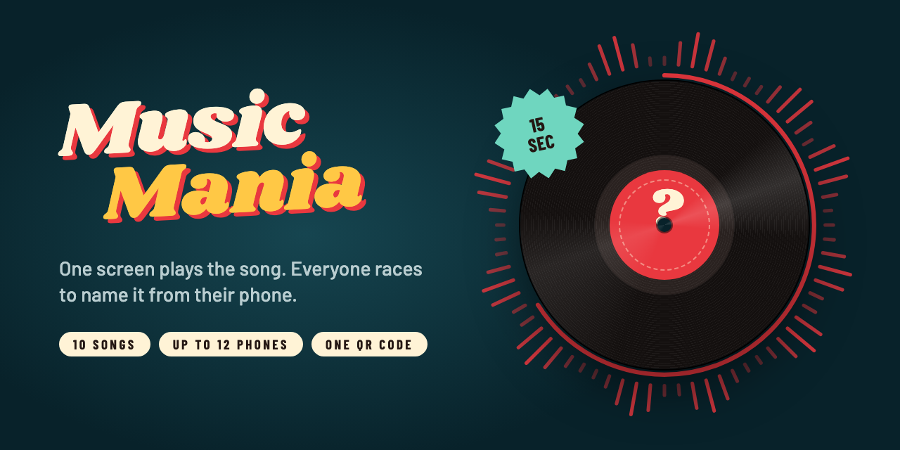
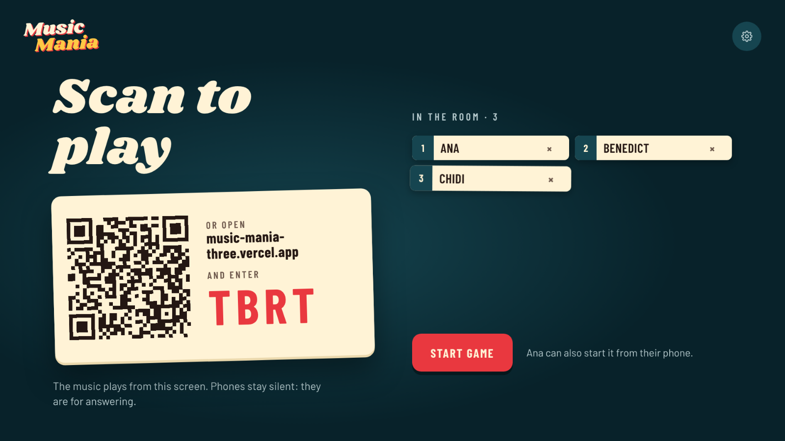
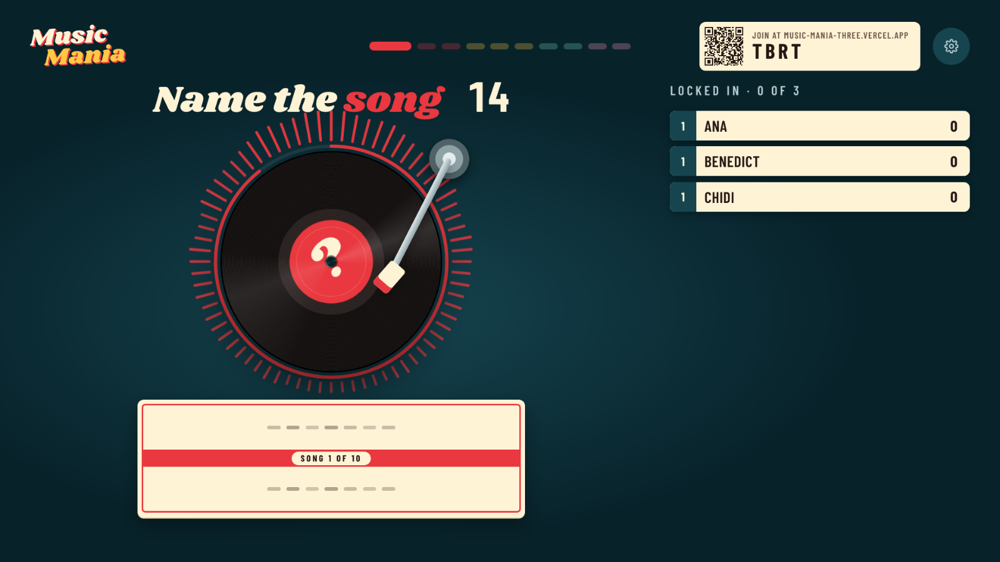
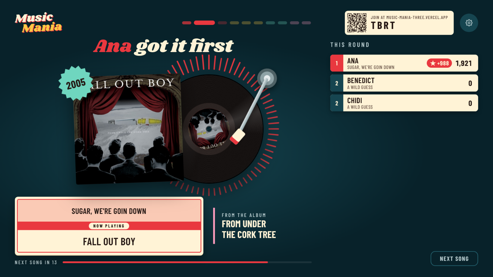
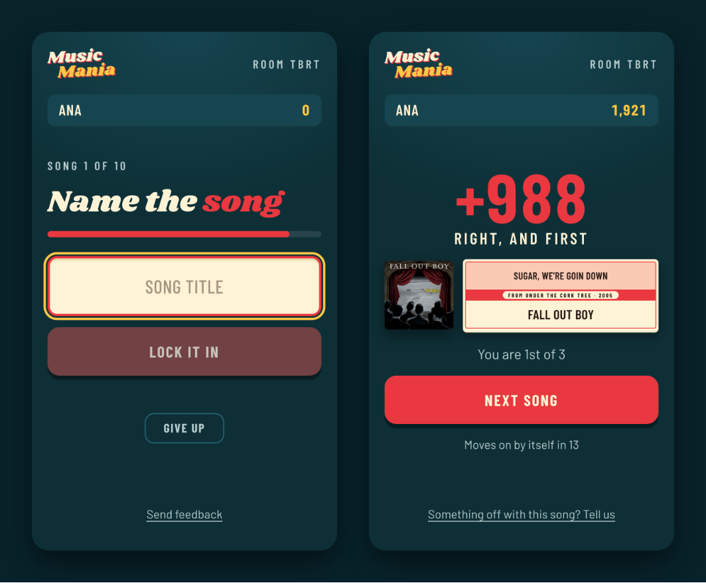

<p align="center">
  
</p>

<p align="center">
  A party name-that-tune game: one big screen plays the song, everybody races to name it from their phone.
</p>

<p align="center">
  <a href="https://music-mania-three.vercel.app"><b>Play it → music-mania-three.vercel.app</b></a>
</p>

Open it on the television. Everyone else scans the code on the screen and
plays from where they are sitting. Nothing to install, no accounts.

<p align="center">
  
</p>

## How to play

1. **Put one screen in front of everyone.** A laptop on the coffee table, or
   mirrored to the TV. Press *Host a game*. The screen prints a QR code and a
   four-letter room code, and it is the only thing that makes noise.
2. **Everyone joins from their phone.** Scan, type a name, wait. Up to twelve
   players. Whoever joined first runs the game and presses *Start* from their
   phone when the room is full enough; after that anybody can push the room on
   to the next song.
3. **Fifteen seconds of a song play.** The record spins, the timer ring runs
   down, and every phone asks one question. The first three rounds want the
   **title**, then three want the **artist**, two want the **year**, and the
   last two want the **album**.
4. **Type it and lock it in.** A right answer is worth 1000 points at the
   first second and 500 at the buzzer, so speed is most of the game. Matching
   is forgiving: typos, a missing apostrophe, a dropped "The" and the
   `feat.` credits are all fine. A year two out still pays a quarter.
5. **The reveal.** The album sleeve slides out from behind the record, the
   title strip flips in, and the round's points land on the scoreboard. Ten
   rounds, then the final scores with a song to see them out.

Nobody knows it? Hit **Give up** to tap out of the round. A white flag drops
onto the television and a sad trombone plays.

## Three ways to play

| Mode            | What plays the music                          | Who answers                        |
| --------------- | --------------------------------------------- | ---------------------------------- |
| **Living room** | A TV or laptop, the way described above       | Everyone, from their phones        |
| **Aux**         | One phone, on the car stereo or a speaker     | Everyone, that phone included      |
| **Solo**        | Your own phone or laptop                      | You                                |

**Aux** is for the car, the kitchen, anywhere without a big screen. Whoever
has the cable picks *Aux* on the landing page, types their name, and their
phone becomes the one on the speakers. It shows the room code big enough to
read from the back seat and a *Send the link* key for texting it. Everyone
else joins as usual; every phone shows the scoreboard at each reveal, since
there is no television to look at. The phone on aux keeps its screen awake,
tells the car's display only "Music Mania · Song 3 of 10" so the dashboard
never gives the answer away, and wires the steering-wheel buttons to pause,
resume and skip. If that phone dozes off between songs, anyone can *Take the
aux*; the one holding it can *Pass the aux* on purpose.

**Solo** is one tap: pick *Solo*, type a name, and the first song is already
loading. Ten songs, about five minutes, a grade at the end from *Demo tape*
up to *Diamond*, and the phone remembers your best.

Under the hood these are one game. A room has a `mode`, and in the two modes
without a big screen one player, the DJ, carries the host's audio duties: it
alone receives preview URLs and reports when sound is actually playing. See
[docs/MODES.md](docs/MODES.md).

<p align="center">
  
  
  
</p>

## How it works

Vercel gives no instance affinity: the phone's `POST` and the television's
event stream almost never land on the same function. So no server holds the
game in memory and no server runs a timer.

The whole game is one pure function, `reduce(state, action, now)`. Phases end
on deadlines carried in the state, not on `setTimeout`; any screen whose own
clock says a deadline has passed may send `tick`, and the first one through
moves the room on. Every write is a compare-and-set on the room's version
number, so two phones answering at once cannot lose each other's answer.
A successful write publishes the new state, and each open stream turns it
into a `RoomView` built for that recipient — which is how the answer stays
secret until the reveal.

```
         the television                          the phones
     ┌──────────────────────┐            ┌──────────────────────┐
     │ /host/DZEB           │            │ /play/DZEB           │
     │ plays the audio      │            │ types the answer     │
     └──────────┬───────────┘            └──────────┬───────────┘
        GET /events (SSE)                    POST /actions
                └──────────────┬──────────────────┘
                               ▼
     ┌───────────────────────────────────────────────────────────┐
     │  route handlers, stateless      reduce(state, action, now) │
     └───────────────────────────────┬───────────────────────────┘
                compare-and-set on state.version
                                     ▼
              Redis ──── publish ────▶ every open event stream
```

Without `REDIS_URL` the store is a map in the dev server's process, which
behaves the same on one machine. The music is iTunes' 30-second previews,
played through the Web Audio API so the halo around the record can be drawn
from the live spectrum. The 200-song catalog lives in `data/catalog.json`;
`scripts/build-catalog.mjs` resolves it from a seed list and the iTunes Search
API, and one batch lookup per game refreshes preview URLs that Apple has
moved.

## Run it locally

```bash
npm install
npm run dev
```

Open http://localhost:3000 and press *Host a game*. No Redis needed: the dev
server keeps rooms in memory.

Phones join over your LAN. The host screen notices it is on `localhost`,
asks the dev server for this machine's LAN address and prints *that* in the
QR code, so a phone on the same Wi-Fi can open it. Both devices have to be on
the same network.

## Tests

```bash
npm test        # vitest: the reducer, scoring and answer matching
npm run lint
npm run typecheck
```

`npm run e2e` plays a whole ten-round game in real browsers — one host and
three iPhones — and fails on any console error. `npm run e2e:modes` does the
same for an aux game (three phones, the aux handed around, one phone dying
mid-game and another taking over) and a solo run. Both talk to `BASE_URL`,
`http://localhost:3210` by default, so start the dev server on that port
first:

```bash
npm run dev -- -p 3210
npm run e2e
npm run e2e:modes
```

On a machine that cannot reach Apple's CDN, `STUB_AUDIO=1` answers every
preview request with silence so the game still runs; `CHROMIUM_PATH` points
the scripts at a Chromium that is already installed.

Screenshots land in `e2e/shots/`, which is where the pictures in this README
come from.

## Deploy it

It is a stock Next.js app; Vercel needs no configuration beyond one
environment variable:

| Variable    | What                                                          |
| ----------- | ------------------------------------------------------------- |
| `REDIS_URL` | An [Upstash](https://upstash.com) Redis connection string. |

Add Upstash from the Vercel marketplace and the variable arrives on its own
(`KV_URL` works too). Rooms expire six hours after their last write. On
Vercel a missing variable throws rather than falling back to the in-memory
store, which is deliberate: that store would quietly split a room across
instances.

## Feedback

Every phone carries a *Send feedback* link, and the reveal has a shortcut for
"something is off with this song" that attaches the song in question. Each
report gets a public id like `FB-12` and a status, and anyone can read the
queue at [/feedback](https://music-mania-three.vercel.app/feedback) to see
what was fixed, what was declined, and why.

## Credits

Song previews and album artwork are fetched from
[Apple's iTunes Search API](https://performance-partners.apple.com/search-api)
and belong to their owners. This project is not affiliated with Apple, with
any label, or with any artist. It plays thirty-second previews Apple publishes
for exactly this kind of use, and stores none of them.

Set in [Shrikhand](https://fonts.google.com/specimen/Shrikhand) and
[Barlow](https://fonts.google.com/specimen/Barlow), both under the SIL Open
Font License.

## License

MIT — see [LICENSE](LICENSE).
